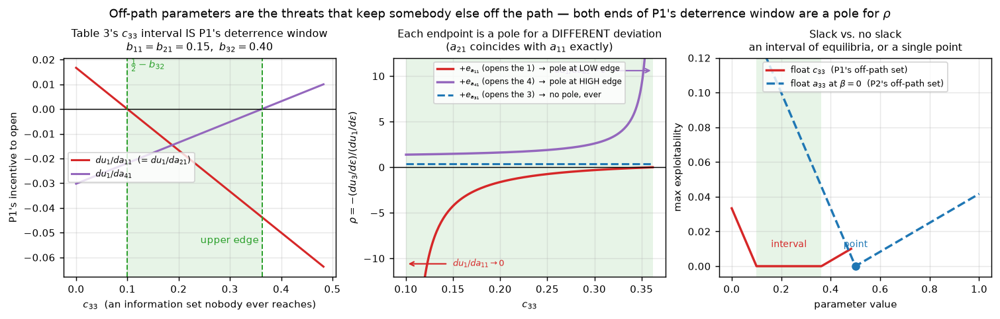

# Three-player Kuhn poker: the Szafron–Gibson–Sturtevant equilibrium family, and what ρ actually measures

## 0. What was built

**Source.** Duane Szafron, Richard Gibson, Nathan Sturtevant, *"A Parameterized Family of
Equilibrium Profiles for Three-Player Kuhn Poker"*, AAMAS 2013, pp. 247–254 —
<https://www.ifaamas.org/Proceedings/aamas2013/docs/p247.pdf>. The equilibrium family is
transcribed verbatim from the paper's **Table 2** (21 necessary parameter values) and
**Table 3** (the family and its three sub-families `c11 = 0`, `0 < c11 < 1/2`, `c11 = 1/2`).
Nothing was invented or approximated.

**Engine.** `kuhn3p.py` builds the entire game tree once: 24 deals × 13 terminal histories
= 312 leaves. Utilities are computed by summing every leaf's reach-probability times its
payoff. No sampling, no CFR, no iteration.

**Independent validation** (`verify_paper.py`, all to machine precision):

| check | result |
|---|---|
| Table 3 utilities `u1 = −κ(½+β)`, `u2 = −κ/2`, `u3 = κ(1+β)` over 600 random family points | max error `5.0e-16` |
| exact rational check at `b11=1/8, b21=1/4` | `u = (−1/32, −1/48, 5/96)` — exactly as predicted |
| paper's worked leaf `a13` in deal 124 | factors `(1−a11)·b21·(1−c42)·a13`, payoff `(−2,3,−1)` — matches |
| Appendix **eq. (3)** (`u3`, P3 free) over 400 random points | max error `6.0e-16` |
| Appendix **eq. (4)** (`u2`, P2 free) | max error `2.2e-16` |
| Appendix **eq. (5)** (`u1`, P1 free) | max error `8.9e-16` |
| Table 4 mismatched profile, and P2's stated gain of `κβ` there | reproduced exactly |
| exact best-response gap on 450 random family points | `< 5e-16` for all three players |

Matching eq. (3)/(4)/(5) is the strong test: those polynomials pin down both the game tree
and the Table-3 transcription (including `b41 = 2b11+2b21` and
`b33 = ½ + (b11+b21)/2 + β/2 − b23(1−b21)`). Note the paper's Section 5 prose gives
`b33 = (1+b11+2b21)/2` for the `c11 = 1/2` sub-family; that is a typo for the swapped-index
version. Table 3's general formula — which the Appendix proof also uses — is the correct one
and is what is implemented.

---

## 1. The premise has to be adjusted, and that adjustment *is* the main finding

The request asks for "a small perturbation of A's strategy that strictly increases `u_A`,
holding B and C fixed."

**No such perturbation exists.** That is the definition of Nash equilibrium, and every
profile in this family is an exact one. Confirmed numerically rather than assumed: over
**9 072 grid points** covering all three sub-families, across **502 626 feasible
(point, direction) pairs**, the number of directions with `du_A/dε > 0` is **exactly 0**:

```
A = P1 : 154224 feasible pairs | IMPROVING 0 | COSTLY 111456 | NEUTRAL (du_A = 0)  42768
A = P2 : 186618 feasible pairs | IMPROVING 0 | COSTLY  52038 | NEUTRAL (du_A = 0) 134580
A = P3 : 161784 feasible pairs | IMPROVING 0 | COSTLY  57072 | NEUTRAL (du_A = 0) 104712
```

So `du_A/dε ≤ 0` always, and feasible directions split into exactly two kinds:

* **costly** — `du_A/dε < 0`. A pays for the deviation. ρ is well defined, and it measures
  *what fraction of A's loss lands on C*.
* **costless / transfer** — `du_A/dε = 0` but the other two move in opposite directions.
  A shifts utility between B and C for free. ρ has a **zero denominator**.

I therefore analysed both classes. The costly class is the closest well-defined analogue of
"exploitation direction" (the deviation A would make if forced to move), and the costless
class is exactly the phenomenon the paper is about. Separately, §5 below computes ρ at a
point where a *genuinely improving* direction does exist — the paper's own Table 4 profile,
which is deliberately not an equilibrium.

Useful reformulation: since `du_A + du_B + du_C = 0`,

> **ρ_{A→B} + ρ_{A→C} = 1.**

ρ is a *share*: the fraction of A's utility swing that lands on C. ρ ∈ (0,1) means B and C
split A's loss. ρ < 0 means C loses too (B gains more than A loses). ρ > 1 means C gains
more than A loses (B loses as well). ρ is also invariant under `d → −d`, so it depends only
on *which* parameter is perturbed, not on the sign of the step.

Convention used: A = P1 → (B,C) = (P2,P3); A = P2 → (P3,P1); A = P3 → (P1,P2).

---

## 2. Zero-sum identity: verified, and it cannot fail

Central differences (`h = 1e-5`) over 9 072 points × 48 coordinates:

```
max |du_1 + du_2 + du_3|  (central difference) = 2.8e-11
max |du_1 + du_2 + du_3|  (exact)              = 3.5e-16
points flagged as violating zero-sum (> 1e-9)  = 0
```

**Nothing to flag, and nothing could ever be flagged.** Every leaf of the tree pays out
exactly the chips paid in — the three payoffs sum to 0 at all 312 leaves — so
`Σᵢ uᵢ(p) = 0` identically on all of `[0,1]⁴⁸`, not just on the equilibrium family. The
zero-sum identity is a property of the *game*, not of the equilibrium, and it holds off the
family, off the simplex, everywhere. The residual `2.8e-11` is pure floating-point noise
from dividing by `2h = 2e-5`.

Also verified: because `uᵢ` is multilinear, it is *affine* along any single coordinate, so
the central difference is not an approximation at all —
`max |central_diff − exact| = 2.4e-11`, again just round-off.

---

## 3. The four questions

Grid: 9 072 points — sub-family A 2 268, B 2 268, C 4 536 — sweeping `b11, b21, b23, b32,
c11, c33, c34` across their full valid ranges, with β spanning `[0, 0.25]`. Dense 1-D
sweeps use 201 points each. (Requirement was ≥ 100.)

### (1) Is ρ well-defined everywhere? **No — and not by a narrow margin.**

* **19 of the 48 parameters have `du_A/dε ≡ 0` at *every* grid point.** Of these,
  `b11, b21, b41` (P2) and `c11, c21` (P3 — on most, not all, of the grid) are
  **costless directions**: `du_A = 0` while `du_B = −du_C ≠ 0`. Section 4.1 shows only
  P2's are equilibrium-preserving transfers. The rest
  (`a33, a44, b12, b22, b32, b33, b42, b44, c13, c14, c23, c24, c33, c34, c43, c44`) are
  *null*: they sit at unreached information sets and move nobody. Note this includes
  `b32`, `c33`, `c34` — since P1 never bets in this family, those sets are off-path.
* **A further 21 parameters have `du_A = 0` on part of the grid** — boundary sub-manifolds
  where the equilibrium indifference becomes exact.
* Where the denominator is nonzero it is **not bounded away from zero**: it gets as small
  as `1.0e-4` against κ = 0.0417, i.e. within 0.25 % of zero. Consequently ρ is not merely
  undefined on a thin set — it is **unbounded**, reaching `−50` and `+391` on this grid and
  diverging as the boundary is approached.

The single most important case: **P2's move along the family** (β increasing, with
`b11, b21, b33, b41` all tracking) gives

```
du/dβ = (−κ, 0, +κ)      identically, in all three sub-families
```

so with A = P2 the denominator is **exactly zero** while the numerator is `κ ≠ 0`. The
paper's headline phenomenon is precisely the case where ρ blows up.

### (2) Sign of ρ: **not constant — it flips, and I can say exactly where.**

* **Sign flips (+ and − both occur, along a single fixed direction, purely from moving the
  free parameters): `a11`, `a21`, `a41`** — all P1 directions.
  For `d = +e_{a11}` (P1 starts bluff-betting the 1), ρ ranges over `[−48.75, +22.0]`, with
  4 844 grid points negative, 906 in `(0,1]`, 1 200 above 1.
* **Reaches 0 without flipping:** `a32`, `c31`.
* **Strictly positive everywhere it is defined:** all of P2's and P3's costly directions —
  `b31 (≡ 0.600)`, `b14, b24, b34 (≡ 1.0)`, `c41 (≡ 1.0)`, `c42 (≡ 0.75)`,
  `c31 ∈ [0, 0.5]`, `c11, c21 ∈ [2, 391]`.

The mechanism behind P1's sign flip is worth stating plainly, because it is not obvious:
the paper gives `∂u1/∂a11 = κ(2 − 4b32 − 4c33)`, which vanishes exactly on the lower edge
`c33 = ½ − b32` of Table 3's `c33` interval. **`b32` and `c33` are never-reached
parameters** — they have literally zero effect on the equilibrium payoffs `(u1,u2,u3)`.
Yet they completely control both the size and the sign of ρ for P1. Whether P3 gains or
loses when P1 deviates is decided by off-path behaviour that is invisible in the payoffs.
§4.2 works out why those two parameters are free in the first place, and why no analogous
exposure exists for P2 or P3.

### (3) Plots

* `fig1_rho_parallel_direction.png` — ρ vs β for the one directly comparable deviation
  across all three players ("bluff-bet the 3 in round 1": `a31`, `b31`, `c31`), on four
  slices through the three sub-families, 201 points each.
* `fig2_rho_illdefined_and_signflip.png` — for A = P1, `d = +e_{a11}`: the three
  directional derivatives vs `c33`; ρ diverging through the pole and crossing zero; and a
  121 × 121 sign map over `(β, c33)` with the zero contour drawn.
* `fig3_costless_transfers.png` — the four costless transfer directions, showing
  `du_A/dε ≡ 0` while the other two move equal and opposite.
* `fig4_offpath_deterrence.png` — why P1 alone is exposed to off-path indeterminacy
  (§4.2): the deterrence window, ρ running from pole to zero across it, and the
  interval-versus-point contrast against P2.

### (4) Comparing the three choices of A

Using the one deviation that is structurally identical for all three players — *bet the 3
in the opening round when the family says to check* (`a31` / `b31` / `c31`):

| A | direction | C | ρ over the grid | interpretation |
|---|---|---|---|---|
| P1 | `+e_{a31}` | P3 | `0.273 → 0.400`, decreasing; depends on `b11` and `b21` separately, not on `c11`, `b32`, `c33` | P1's loss splits ~⅔ to P2, ~⅓ to P3 |
| P2 | `+e_{b31}` | P1 | **exactly 3/5, everywhere in the family** | 60 % of P2's loss to P1, 40 % to P3 |
| P3 | `+e_{c31}` | P2 | **`(2 − 4s)/(4 − 5s)` with `s = b11 + b21`**, verified exactly; independent of `c11` | falls `0.5 → 0` as `s` runs `0 → 1/2`; at the family's extreme corner `b11 = b21 = 1/4` all of P3's loss goes to P1 |

The `c31` row explains the "touches 0 but does not flip" entry in (2): `ρ = 0` exactly at
`s = b11 + b21 = 1/2`, which is reachable only at the single corner `b11 = b21 = 1/4`. The
formula would go negative for `s > 1/2`, but the family's own bounds `b11, b21 ≤ 1/4` stop
it right at the sign change.

The players are structurally **not** symmetric:

* **P2 is the one with a clean, parameter-independent split.** ρ = 3/5 is constant over the
  entire family — every sub-family, every value of every free parameter.
* **P2 also owns the largest costless lever.** It has three transfer coordinates
  (`b11, b21, b41`) plus the whole along-family β direction, available at **9 072 / 9 072**
  grid points. This is the paper's result: P2 controls κβ of utility that it can move from
  P1 to P3 at no cost to itself.
* **P3 has costless single-coordinate directions** (`c11`, `c21`) at many points, but they
  are *not* equilibrium-preserving transfers, and its in-family `c11` parameter moves
  nobody's payoff at all — see §4.1, which withdraws the stronger version of this claim.
* **P1's costless directions exist only on boundary sub-manifolds** (7,484 / 9,072 points,
  via `a11, a21, a22, a32, a41`), and P1 is the only player whose ρ changes sign.

So: all three players have directions that cost them nothing to first order, but only P2's
survives a finite step while staying inside the equilibrium set.

---

## 4. Two follow-ups that changed the conclusions

### 4.1 `c11` is not a lever — the "P3 has costless transfers too" claim is withdrawn

Table 3 ties `c21 = 1/2 − c11`, so there are two different objects here, and the first pass
conflated them.

**In-family.** Move `c11` and `c21` together. That is literally a walk along the sub-family
index: `c11 = 0` is sub-family A, `0 < c11 < 1/2` is B, `c11 = 1/2` is C. Taking
`b11 = b21 = 0.15` (≤ 1/6, so every sub-family's constraints stay satisfiable) lets `c11`
run the whole way:

| `c11` | sub-family | `u1` | `u2` | `u3` | exploitability |
|---|---|---|---|---|---|
| 0.00 | A | −0.02708333 | −0.02083333 | +0.04791667 | 7e−17 |
| 0.25 | B | −0.02708333 | −0.02083333 | +0.04791667 | 7e−17 |
| 0.50 | C | −0.02708333 | −0.02083333 | +0.04791667 | 8e−17 |

`u(c11=1/2) − u(c11=0) = (0, 0, 0)` exactly, and the direction `d = +e_{c11} − e_{c21}`
gives `du = (0, 0, 0)`. **The in-family `c11` lever is null** — not a transfer, and not
Finding 1 under another name either. It moves nobody's payoff, because Table 3's utilities
depend only on β, and β = max{b11, b21} is built entirely from P2's parameters. P3 has no
in-family parameter that changes anyone's utility.

**Single-coordinate.** `+e_{c11}` with `c21` held *does* leave the family and *is* a real
costless direction for P3. But it is a much weaker object than P2's β, and the
discriminating test is whether the profile you land on is still an equilibrium at a finite
step:

| direction | `du/dε` | ε = 0 | ε = 0.02 | ε = 0.05 |
|---|---|---|---|---|
| P2 `+e_{b11}` (single coord, leaves family) | (−0.0208, 0, +0.0208) | 7e−17 | **4.2e−4** | **1.0e−3** |
| **P2 β (in-family: `b11,b21,b33,b41`)** | **(−0.0417, 0, +0.0417)** | 7e−17 | **1.1e−16** | **1.1e−16** |
| P3 `+e_{c11}` (single coord, leaves family) | (−0.0292, +0.0292, 0) | 7e−17 | **1.9e−3** | **4.8e−3** |
| P3 `+e_{c21}` (single coord, leaves family) | (−0.0292, +0.0292, 0) | 7e−17 | **1.9e−3** | **4.8e−3** |
| P3 in-family `c11` (with `c21`) | (0, 0, 0) | 7e−17 | 1.5e−16 | 1.2e−16 |

(columns 3–5 are max exploitability). Only P2's β move both transfers utility and stays an
exact Nash equilibrium. P3's indifference is also conditional, not global: the paper's
Lemma 3 gives `∂u3/∂c11 = κ(2b11 − 2β)`, zero only where `b11 = β`, and
`∂u3/∂c21 = κ(2b21 − 2β + 4b23(1−b21))`, zero only where that combination equals β.

> **Corrected claim.** P2's β is the only direction anywhere in the family that is at once
> (a) costless to the mover, (b) utility-moving between the other two, and
> (c) equilibrium-preserving at a finite step. The earlier bullet claiming P3 has an
> equivalent lever is withdrawn.

### 4.2 P1's off-path exposure: the mechanism, and why the other two are immune

**Where the off-path region is.** 14 of the 48 parameters are unreached at a generic family
point: `a44, b12, b22, b32, b42, b44, c13, c14, c23, c24, c33, c34, c43, c44`. Every one of
them sits behind P1's opening bet — Table 3 forces `a11 = a21 = a31 = a41 = 0`, so P2 never
faces a bet and P3 never reaches BF/BC. **Only P1 can unilaterally re-open that subtree**;
no deviation by P2 or P3 can make P1 bet.

**Off-path does not mean arbitrary.** My first guess was that Theorem 1's exemption
("…unless a parameter is a non-reached strategy parameter") leaves these values free. That
guess is wrong, and the way it is wrong is the whole mechanism. Floating each one alone
over [0,1] and recomputing exact exploitability:

| parameter | Table 3 says | max exploitability over [0,1] | who objects |
|---|---|---|---|
| `c34`, `c44` | free / pinned to 1 | 7e−17 | **nobody — unconstrained** (but not inert, see below) |
| `b32` | free interval | 6.7e−2 | P1 |
| `c33` | free interval | 5.3e−2 | P1 |
| `b12, b22, b42, b44, c13, c14, c23, c24, c43` | pinned | 1.1e−2 … 7.6e−1 | P1 |
| `a44` | pinned to 1 | 5.0e−2 | P3 |

Theorem 1 exempts an off-path parameter from *its owner's* incentive constraint, but the
parameter still sits inside somebody **else's** — it is the threat that keeps that other
player off the path. Off-path values are pinned by whoever they deter.

**Table 3's `c33` interval is exactly P1's deterrence window.** At `b11 = b21 = 0.15`,
`b32 = 0.40`, Table 3 gives `c33 ∈ [0.1000, 0.3625]`, and:

```
  c33      du1/da11    du1/da41    P1 exploitability
 0.080     +0.003333   -0.023542    6.7e-03     outside
 0.100     +0.000000   -0.021875    7.3e-17     lower endpoint
 0.231     -0.021875   -0.010937    7.3e-17     interior
 0.362     -0.043750   +0.000000    7.3e-17     upper endpoint
 0.382     -0.047083   +0.001667    1.7e-03     outside
```

The endpoints are precisely where P1's two deterrence derivatives hit zero:
`∂u1/∂a11 ≤ 0 ⟺ c33 ≥ 1/2 − b32` is the lower bound, `∂u1/∂a41 ≤ 0` is the upper.

**That is why P1's ρ must have a pole.** For P1's opening deviations
`ρ = −(du3/da_j1)/(du1/da_j1)`, and the denominator *is* the quantity Table 3 constrains to
be ≤ 0 in order to keep P1 from opening. A constraint `X ≤ 0` whose feasible set includes
its own boundary puts a zero of the denominator on the edge of the equilibrium region. The
pole is structural, not accidental — and at the other endpoint ρ passes through exactly 0.

**Verified at all three of P1's exposed openings, not just `a11`.** `∂u1/∂a_j1` is affine in
`c33`, so its zero can be solved for exactly and compared against Table 3's endpoints. Over
48 family points spanning all three sub-families, `b32 ∈ {0, 1/4, 1/2}` and `c34 ∈ {0, 1}`:

| deviation | zero of `du1/da_j1` sits at | max error |
|---|---|---|
| `+e_{a11}` | `lo = 1/2 − b32`, Table 3's **lower** bound on `c33` | 6.7e−16 |
| `+e_{a21}` | `lo` — the same expression, since Lemma 5 gives `du1/da21 = du1/da11` once `a22 = a23 = 0` | 6.7e−16 |
| `+e_{a41}` | `hi = lo + 3(b11+b21)/4 + β/4`, Table 3's **upper** bound | 1.2e−15 |
| `+e_{a31}` | **no zero at all** — `du1/da31` has no `c33` dependence, in 48 of 48 cases | — |

So the interval is not incidental to one direction. **Its lower bound exists to kill
`a11`/`a21`, its upper bound exists to kill `a41`, and both bounds are attainable.** Each
endpoint is a pole of ρ for a *different* deviation, approached from opposite sides:

```
 c33 position     du1/da11     rho(a11)     du1/da41     rho(a41)
 lo (endpoint)   +0.0000000   undefined    -0.0218750   +1.38
 lo + 1e-4       -0.0000044   -9999.00     -0.0218728   +1.38
 midpoint        -0.0218750   -1.00        -0.0109375   +1.76
 hi - 1e-4       -0.0437456   -0.00        -0.0000022   +3810.52
 hi (endpoint)   -0.0437500   +0.00        +0.0000000   undefined
```

Each direction is perfectly well behaved at the *other* one's pole, which is what makes this
a statement about the geometry of the family rather than about one deviation. And the pole
is not an isolated point: `du1/da11 = du1/da21 = 0` identically along the whole line
`c33 = 1/2 − b32`, so it is a codimension-1 surface inside the family (checked at
`b32 = 0, 0.15, 0.30, 0.45` with exploitability 7.3e−17 throughout).

**Why P2 and P3 are immune.** The distinguishing feature is not off-path-ness. It is
whether the deterrence constraint binds with **slack** (an interval) or with **equality**
(a point).

* At β > 0, P2 does open (`b11, b21, b41 > 0`), so nothing behind P2's bet is off-path at all.
* At β = 0, P2's bet subtree *is* off-path — the exact control case. But every parameter
  there has a feasible set that is a **single point**, and P2 is the player who objects in
  each case:

  | parameter | value | feasible set at β = 0 | effect on ρ(`b31`) |
  |---|---|---|---|
  | `c12, c22, c32` | 0 | point {0} | rigid 3/5 |
  | `a13, a23` | 0 | point {0} | rigid 3/5 |
  | `a33` | 1/2 | point {1/2} | rigid 3/5 |
  | `c42, a43` | 1 | point {1} | rigid 3/5 |

  They are pinned to points because those same information sets are **on-path whenever
  β > 0**, and Table 3 must give one value valid across the whole family. No slack, no
  residual freedom, no indeterminacy — which is exactly why ρ(`b31`) = 3/5 is rigid.
* P3 acts last, so no subtree sits behind a P3 opening bet that is off-path family-wide.

**Even P1 is only exposed with the right card.** All three genuinely free off-path
parameters — `b32`, `c33`, `c34` — are **card-3** parameters, so a P1 opening bet reaches
them only if an opponent can hold the 3:

| P1 opens with | reach(`b32`) | reach(`c33`) | reach(`c34`) | ρ indeterminate? |
|---|---|---|---|---|
| card 1 | 0.041667 | 0.020833 | 0.020833 | yes |
| card 2 | 0.041667 | 0.020833 | 0.020833 | yes |
| card 3 | 0 | 0 | 0 | **no** |
| card 4 | 0.041667 | 0.041667 | 0 | yes, via `b32` and `c33` |

This matches the sensitivity sweep exactly: ρ for `a11` and `a21` is moved by `b32`, `c33`
*and* `c34`; ρ for `a41` by `b32` and `c33` only; ρ for `a31` by none of them — so `a31` is
the one P1 opening deviation with a determinate ρ.

**Correction: `c34` and `c44` are unconstrained, but they are not inert.** The prediction was
that if nobody's incentive touches them, every first derivative must vanish for all three
players unconditionally. It does, exactly:

```
max |du_i/dc34| over 9,072 grid points x 3 players = 0.000e+00   (exactly zero)
max |du_i/dc44| over 9,072 grid points x 3 players = 0.000e+00   (exactly zero)
exploitability for every value in [0,1]            = 7.3e-17
```

But a zero *first* derivative only says the set is off-path **now**. What matters for ρ is
what happens once P1 re-opens it — a mixed *second* derivative — and those are not zero:

| `x` | `∂²u/(∂a11 ∂x)` | `∂²u/(∂a21 ∂x)` | via `a31` | via `a41` |
|---|---|---|---|---|
| `c34` | (0, +0.042, −0.042) | (0, +0.042, −0.042) | 0 | 0 |
| `c44` | (0, −0.083, +0.083) | (0, −0.083, +0.083) | 0 | 0 |
| `c33` | (−0.167, 0, +0.167) | (−0.167, 0, +0.167) | 0 | (+0.083, 0, −0.083) |
| `b32` | (−0.167, +0.125, +0.042) | (−0.167, +0.125, +0.042) | 0 | (+0.083, −0.083, 0) |

I had called `c44` inert. It is not: it becomes reachable as soon as `b32 > 0`, because to
sit at BC holding the 4, P3 needs P2 to have called with something other than the 4 — and in
this family P2's only other calling card is the 3, with probability `b32`:

| `b32` | reach(`c44`) after `a11 = 0.5` | `∂²u3/(∂a11 ∂c44)` |
|---|---|---|
| 0.00 | 0 | 0 |
| 0.10 | 0.00208333 | +0.020833 |
| 0.40 | 0.00833333 | +0.083333 |

This does not hole the owner/slack classification — that is a statement about which player's
*first-order* incentive pins a parameter, and it stands unchanged. What it kills is the
inference that an unconstrained parameter is irrelevant. Reachability decides that, and both
of these sit one deviation away from being reached. So P1's ρ has **two independent sources
of indeterminacy**:

* **denominator** ← `b32`, `c33`. Constrained, but by an *inequality* whose boundary is
  attainable, so ρ has a pole on the edge of the equilibrium set.
* **numerator** ← `c34`, `c44`. Constrained by nobody at all, so ρ's *value* is undetermined
  even where the denominator is safely away from zero.

> **The generalizable claim.** A player's ρ is exposed to off-path indeterminacy exactly
> when the subtree their deviation re-opens contains off-path parameters whose deterrence
> constraints have slack. In this family that is P1 alone, and only when P1 does not hold
> the 3. "Because P1 is the only player with zero free parameters" is close but is not the
> mechanism: P1's forced silence is what *creates* the family-wide off-path region, but the
> exposure itself comes from P1's two deterrence conditions being opposing inequalities
> that leave a gap between them — and, separately, from the numerator of P1's ρ depending
> on `c34` and `c44`, which no player's incentive constrains at all.



*`fig4_offpath_deterrence.png` — left: Table 3's `c33` interval coincides with the window
where both of P1's opening deviations are unprofitable. Middle: each endpoint of that window is a
pole for a *different* deviation — `a11` (and `a21`) diverge at the lower edge, `a41` at the
upper edge, while `a31` (P1 opening with the 3, which cannot reach any free off-path
parameter) has no pole anywhere. Right: floating `c33`
keeps exploitability at zero across an interval; floating `a33` at β = 0 keeps it at zero
only at the single point 1/2.*

---

## 5. Reproduce it by hand — one grid point, start to finish

**Grid point.** Sub-family A (`c11 = 0`) with `b11 = b21 = 0`, hence β = 0; also
`b23 = 0`, `b32 = 0`, `c33 = 1/2`, `c34 = 0`. Table 2 + Table 3 then give the full profile:

```
a11=0    a12=0    a13=0    a14=0            b11=0    b12=0    b13=0    b14=0
a21=0    a22=0    a23=0    a24=0            b21=0    b22=0    b23=0    b24=0
a31=0    a32=0    a33=1/2  a34=0            b31=0    b32=0    b33=1/2  b34=0
a41=0    a42=1    a43=1    a44=1            b41=0    b42=1    b43=1    b44=1

c11=0    c12=0    c13=0    c14=0
c21=1/2  c22=0    c23=0    c24=0
c31=0    c32=0    c33=1/2  c34=0
c41=1    c42=1    c43=1    c44=1
```

In words: **P1 and P2 never bet.** After two checks, **P3 bets the 4 always and the 2 half
the time**, and checks otherwise. Facing P3's bet, P1 calls only with the 4 (`a42 = 1`);
if P1 folds, P2 calls with the 4 always and the 3 half the time (`b33 = 1/2`).

Equilibrium utilities: `u = (−1/48, −1/48, 1/24)`, matching `(−κ(½+0), −κ/2, κ(1+0))`.

**Player A = P2. Direction `d_A = +e_{b31}`:** P2 starts betting the 3 after P1 checks. The
family says `b31 = 0`, so `+e` is the only feasible direction, and this is a strictly costly
one.

Only the **6 deals in which P2 holds the 3** can be affected — everything else is untouched
— so the whole derivative is a six-row hand calculation. For each deal compare P2 betting
against P2 checking. Each deal has probability κ = 1/24.

| deal (P1,P2,P3) | P2 **bets** → (u1,u2,u3) | P2 **checks** → (u1,u2,u3) | difference |
|---|---|---|---|
| (1,3,2) | (−1, 2, −1) | (−1, 3/2, −1/2) | (0, +1/2, −1/2) |
| (1,3,4) | (−1, −2, 3) | (−1, −3/2, 5/2) | (0, −1/2, +1/2) |
| (2,3,1) | (−1, 2, −1) | (−1, 2, −1) | (0, 0, 0) |
| (2,3,4) | (−1, −2, 3) | (−1, −3/2, 5/2) | (0, −1/2, +1/2) |
| (4,3,1) | (+3, −2, −1) | (+2, −1, −1) | (+1, −1, 0) |
| (4,3,2) | (+3, −2, −1) | (+5/2, −1, −3/2) | (+1/2, −1, +1/2) |
| **sum** | | | **(+3/2, −5/2, +1)** |

Two of the rows spelled out:

*Deal (1,3,2).* **Bet:** P3 holds the 2 and `c22 = 0`, so P3 folds; P1 holds the 1 and
`a13 = 0`, so P1 folds; P2 takes the pot of 1+2+1 = 4, netting +2 → `(−1, +2, −1)`.
**Check:** P3 bets the 2 with probability `c21 = 1/2`. If P3 checks (½), three-way
showdown and P2's 3 is highest, pot 3 → `(−1,+2,−1)`. If P3 bets (½), P1 folds (`a12 = 0`),
then P2 calls with probability `b33 = 1/2`: folding gives P3 the pot of 4 → `(−1,−1,+2)`;
calling wins the showdown 3 > 2, pot 5 → `(−1,+3,−2)`; average `(−1,+1,0)`. So checking
averages `½(−1,2,−1) + ½(−1,1,0) = (−1, 3/2, −1/2)`. Difference `(0, +1/2, −1/2)`.

*Deal (4,3,1).* **Bet:** P3 holds the 1 and folds (`c12 = 0`); P1 holds the 4 and calls
(`a43 = 1`); P1 wins the showdown, pot 2+2+1 = 5 → `(+3, −2, −1)`. **Check:** P3 holds the
1 and checks (`c11 = 0`); three-way showdown, P1's 4 wins the pot of 3 → `(+2, −1, −1)`.
Difference `(+1, −1, 0)`.

**Result.** Multiply the column sums by κ = 1/24:

```
du1/dε = (3/2)/24  = +1/16   = +0.062500
du2/dε = (−5/2)/24 = −5/48   = −0.104167
du3/dε = (1)/24    = +1/24   = +0.041667
zero-sum:  1/16 − 5/48 + 1/24 = 3/48 − 5/48 + 2/48 = 0   ✓
```

The engine's central finite difference and its exact multilinear derivative both return
`(+0.06250000, −0.10416667, +0.04166667)`; agreement with the hand figures is `2.7e-12`.

With A = P2 the cyclic convention gives C = P1, so

```
ρ = −(du1/dε)/(du2/dε) = −(1/16)/(−5/48) = 3/5 = 0.600
complement:  ρ_{P2→P3} = −(1/24)/(−5/48) = 2/5 = 0.400        (they sum to 1 ✓)
```

**Reading it in plain language:** P2 bluff-betting the 3 costs P2 2.5/24 chips per unit of
ε. Exactly 60 % of that lands on P1 and 40 % on P3. The denominator is strictly negative,
so ρ is well defined here — and it stays exactly 3/5 over the entire family.

### Why this one hand calculation is enough for the whole family

Redo the six rows keeping `c11`, `c21` and `b33` as symbols instead of plugging in
`0, 1/2, 1/2`. Deals (1,3,2), (1,3,4), (2,3,1), (2,3,4) leave P1 with `−1` either way
(P1 always folds, holding the 1 or the 2), so they contribute nothing to `du1`; deals
(4,3,1) and (4,3,2) contribute `1 − c11` and `1 − c21`. For P2, the two "P1 holds the 4"
deals contribute `−1` each, the two "P3 holds the 4" deals contribute `−1 + b33` each, and
the two deals where P3's low card can bet contribute `c11(3 − 4b33)` and `c21(3 − 4b33)`.
Collecting:

```
24 · du1/dε = 2 − (c11 + c21)
24 · du2/dε = (c11 + c21)(3 − 4·b33) + 2·b33 − 4
```

Table 3 fixes **`c21 = 1/2 − c11`**, i.e. `c11 + c21 = 1/2`, so

```
24 · du1/dε = 2 − 1/2                       = +3/2
24 · du2/dε = (1/2)(3 − 4 b33) + 2 b33 − 4  = 3/2 − 2 b33 + 2 b33 − 4 = −5/2
```

The `b33` terms cancel identically, and `b11`, `b21`, `b23`, `b32`, `c33`, `c34` never
entered. That is why ρ = 3/5 is a constant of the whole family rather than a coincidence at
β = 0: it rides entirely on P3's constraint `c11 + c21 = 1/2`. (Both formulas were checked
against the engine, including at a deliberately illegal point with `c11 + c21 = 0.3`, where
they correctly predict the *different* values `du1 = +0.0708`, `du2 = −0.1050`.)

Contrast this with `d = +e_{b11}` at the *same* grid point, where the engine returns
`(+1/12, 0, −1/12)`: P2 pays nothing, P1 gains 1/12 and P3 loses 1/12. There ρ = −(1/12)/0
is undefined. That is the same phenomenon as the paper's β transfer, seen one coordinate
at a time.

---

## 6. The one place a genuinely improving direction exists

The paper's **Table 4** deliberately mismatches sub-families: P2 plays a `c11 = 1/2`
strategy (`b11 = 1/4, b21 = 0, b23 = 1/8, b33 = 5/8, b41 = 1/2`) while P3 plays a
`c11 = 0` strategy. It is not an equilibrium; the paper states P2 can gain κβ. Confirmed:
P2's exact exploitability there is `0.0104167 = κ/4 = κβ`.

The improving direction is `d_A = −e_{b23}` (P2 stops calling P3's bet with the 2 after P1
has folded). Central differences:

```
du1/dε = −0.000000    du2/dε = +0.083333 = 2κ    du3/dε = −0.083333
ρ_{P2→P1} = 0.0000    ρ_{P2→P3} = 1.0000
```

Here the denominator is genuinely *positive*, and ρ is well defined. **P2's entire gain
comes out of P3; P1 is untouched.** And the magnitudes tie out: `2κ × (1/8) = κ/4 = κβ`,
exactly the exploitability the paper quotes.

---

## 7. Does the mechanism generalize past round 1? Yes — and the criterion has three parts

`∂u_owner/∂x` is affine in each single free parameter, so the same closed-form solve used for
`a11`/`a21`/`a41` works at any decision. Running it at **round-2 call decisions**
(situations `k = 2,3,4`, facing a bet) rather than opening bets:

**Positive case — `a22`** (P1 calls P3's bet at KKB holding the 2). Lemma 5 gives
`du1/da22 = κ(1−a21)(b11 + 2(b11+b21)c11 + 3c11 − 2)`, affine in `c11`. Its root sits exactly
on Table 3's **upper bound on `c11`**, `(2−b11)/(3+2b11+2b21)`:

```
   b11    b21    b23   | root(c11)   c11_max     |diff|
   0.00   0.00   0.000 | 0.66666667  0.66666667  0.0e+00
   0.10   0.20   0.000 | 0.52777778  0.52777778  5.6e-16
   0.25   0.25   0.000 | 0.43750000  0.43750000  5.6e-17
   0.20   0.05   0.090 | 0.51428571  0.51428571  7.8e-16
   0.25   0.00   0.125 | 0.50000000  0.50000000  1.1e-16      max err 7.8e-16
```

That bound is attainable exactly when `c11_max ≤ 1/2`, i.e. `b21 ≤ 1/2 − 2b11` — which is
*precisely* Table 3's `b21` constraint in the `c11 = 1/2` sub-family. At that corner
`du1/da22 = 0` while `du3/da22 = +0.0229 ≠ 0`: **a genuine pole at a round-2 decision.**

**Positive case — `a32`** (P1 calls at KKB holding the 3). Root at
`b21 = (1 − 8 c11 b11)/(4 − 8 c11)`, verified to 2.7e-15; in sub-family A (`c11 = 0`) that is
`b21 = 1/4`, exactly Table 3's cap. Pole.

Three **negative controls** show the criterion is not automatic:

| control | why no pole |
|---|---|
| `b34` (round-2) | root at `b31 = 1`, but Table 3 pins `b31 = 0` → boundary **not attainable**. `du2/db34 ≡ −0.0208`, ρ ≡ 1 |
| `c22` (round-2) | root at `b11 = b21 = 0` **is** attainable, but the numerator vanishes at the same rate: ρ ≡ 0.800 exactly as `b11 = b21 → 0`, then 0/0 at the corner |
| `a11`/`a21` when `b32 > 1/2` | `c33* = 1/2 − b32 < 0` falls outside `[0,1]` → boundary **not attainable** |

> **The criterion.** ρ has a pole at a deviation `x` iff **(i)** `du_owner/dx = 0` has a root
> in some free parameter, **(ii)** that root is attainable inside the Table 3 constraints, and
> **(iii)** the numerator `du_C/dx` does not vanish there. Each of the three has a witness
> above. Round-1 versus round-2 is irrelevant.

**Full census** over all 48 parameters on the 9,072-point grid:

| | round-1 poles | round-2 poles |
|---|---|---|
| **P1** | `a11`, `a21`, `a41` | `a22`, `a32` |
| **P2** | none | none |
| **P3** | `c11`, `c21` | none |

So the mechanism is **not** specific to opening bets, and **not** specific to P1. What *is*
specific to P1 is where the boundary lives: P1's round-1 poles are located by `b32`/`c33`,
which are **off-path** — never reached, exactly zero effect on the equilibrium utilities.
P3's poles sit at boundaries in `b11`, `b21`, `b23`, which are on-path. And P2 has no poles
at all: every P2 direction either has `du2 ≡ 0` (the transfers) or a ρ that is bounded and
constant.

---

## 8. The divergence rate: a simple pole with an exact residue

Along `c33` alone, **both** `D(c33) = du1/da_j1` and `N(c33) = −du3/da_j1` are affine
(second differences `< 2.2e-16`). So ρ = N/D is a Möbius function of `c33` — a pole of order
**exactly 1**, not merely "ρ blows up":

> **ρ(c33) = R/(c33 − c33*) + O(1)**,  with **R = N(c33*) / D′**.

`D′ = ∂²u1/(∂a_j1 ∂c33)` is a clean multiple of κ = 1/24:

| deviation | `D′` | pole at |
|---|---|---|
| `a11` | `−4κ` | `c33* = lo` |
| `a21` | `−4κ` | `c33* = lo` |
| `a41` | `+2κ` | `c33* = hi` |
| `a31` | `0` | **no pole possible** |

**The residue has a meaning.** At `c33*` the denominator vanishes, so P1's deviation is
*costless* there, and zero-sum forces `du2 = −du3 = t`, the transfer magnitude. Hence
`N(c33*) = t` and

> **R = t / D′** — the residue *is* the size of the costless transfer available at that
> boundary, divided by the denominator slope.

Verified at 4 valid family points × 3 deviations, exact fractions throughout:

```
dev   D'/κ    c33*      transfer t         R = t/D'
a11   −4.0   +0.1000   +0.04375000       −0.26250000 = −21/80
a21   −4.0   +0.1000   +0.04375000       −0.26250000 = −21/80
a41   +2.0   +0.3625   −0.00833333       −0.10000000 = −1/10
a11   −4.0   +0.5000   −0.03645833       +0.21875000 = +7/32
a21   −4.0   +0.5000   −0.01562500       +0.09375000 = +3/32
a41   +2.0   +0.7375   +0.02083333       +0.25000000 = +1/4
a11   −4.0   +0.2000   +0.06875000       −0.41250000 = −33/80
a21   −4.0   +0.2000   +0.04270833       −0.25625000 = −41/160
a41   +2.0   +0.4500   −0.00416667       −0.05000000 = −1/20
```

Rate confirmed empirically — `ρ·(c33 − c33*)` converges to `R`, one decade of relative error
per decade of offset:

```
offset   a11: ρ·(Δc)      rel.err     a41: ρ·(Δc)      rel.err
1e-2    −0.2525000000   3.81e-02    −0.1100000000   1.00e-01
1e-4    −0.2624000000   3.81e-04    −0.1001000000   1.00e-03
1e-6    −0.2624990000   3.81e-06    −0.1000010001   1.00e-05
1e-8    −0.2624999916   3.19e-08    −0.1000000183   1.83e-07
```

(The floor near 1e-8 is float cancellation, not a departure from the model.)

---

## 9. Control: does any of this need three players? No — and it fails for two separate reasons

`kuhn2p.py` is an independent from-scratch exact solver for **two-player** Kuhn poker
(3 cards, 6 deals, 30 leaves), with the standard one-parameter equilibrium family
`α ∈ [0, 1/3]`. Verified first: max exploitability `1.9e-16` over 201 values of α;
`u1 = −1/18` exactly (rational check at α = 1/6 gives `(−1/18, +1/18)`); and α just outside
`[0, 1/3]` **is** exploitable (0.020 at α = −0.02, 0.010 at α = 1/3 + 0.02), so the interval
is exactly right.

**Reason 1 — there is no third party, so a costless transfer is arithmetically impossible.**
Over 201 α × every feasible single-coordinate direction:

```
strictly costly (du_A < 0)         : 1403
du_A = 0 AND opponent moves        :    0   <-- costless transfers
du_A = 0 and nothing moves (null)  : 2011
max |du_1 + du_2|                  : 0.000e+00
```

Zero-sum with two players gives `du2 = −du1` *identically*, so `du_A = 0` forces `du_B = 0`.
Every free-parameter direction is exactly `(0, 0)`:

```
alpha=0.0000 : x11=(+0.00000,+0.00000)  x31=(−0.00000,+0.00000)  x22=(+0.00000,+0.00000)
alpha=0.1667 : x11=(+0.00000,+0.00000)  x31=(−0.00000,+0.00000)  x22=(−0.00000,+0.00000)
alpha=0.3333 : x11=(+0.00000,+0.00000)  x31=(−0.00000,+0.00000)  x22=(+0.00000,+0.00000)
```

against the three-player counterparts `du/db11 = (+1/12, 0, −1/12)`,
`du/db21 = (+1/24, 0, −1/24)`, `du/db41 = (−1/24, 0, +1/24)`. And ρ is **identically 1** over
all 1,403 defined (point, direction) pairs — range
`[1.000000000000000, 1.000000000000000]` — even though `|du_A|` gets down to `8.3e-4`. No
pole is possible: numerator and denominator are the same number up to sign, so they vanish
together.

**Reason 2 — the boundary structure isn't there either.** The off-path region exists only at
the single endpoint α = 0 (where P1 never bets), not family-wide as in three-player Kuhn. And
those off-path parameters are pinned to a **point**, not an interval:

| | zero-exploitability set | width |
|---|---|---|
| 2-player `y12` (family value 0) | `[0.000000, 0.000000]` | 0 — **no slack** |
| 2-player `y22` (family value 1/3) | `[0.333333, 0.333333]` | 0 — **no slack** |
| 2-player `y32` (family value 1) | `[1.000000, 1.000000]` | 0 — **no slack** |
| 3-player `c33` at `b11=b21=0.15, b32=0.40` | `[0.1000, 0.3625]` | **0.2625 — slack**, matching Table 3 exactly |

**Closing the loop.** The two-player family is *interchangeable*: every member pays exactly
`−1/18`, spread `2.4e-16` across the whole family. The three-player family is not — `u1`
ranges over `[−0.03125, −0.02083]` and `u3` over `[0.04167, 0.05208]`, a spread of `κ/4` each,
while `u2` stays pinned at `−κ/2`. That lost interchangeability is exactly what makes ρ a
quantity worth measuring: with two players ρ is 1 by arithmetic and there is nothing to
indeterminate. With three, zero-sum constrains only the *sum* of the other two, leaving a
one-dimensional space of splits that the equilibrium conditions do not pin down — and the
family's own boundaries are where that indeterminacy becomes infinite.

---

## 10. Does a refinement collapse the indeterminacy? Partly — it separates the two sources

All of ρ's indeterminacy sits at information sets of reach probability zero, which is exactly
what Selten (1975) / Kreps–Wilson (1982) refinements discipline. Perturbing P1's opening with
trembles `a_{j1} = ε·r_j` gives every set positive reach, so each off-path owner's optimal
action is decided by the sign of `∂u_owner/∂x` and the belief is an explicit function of `r`.

**`c34` and `c44` are pinned by dominance, belief-free.** The per-unit-reach advantage is
identical under every tremble ratio tested — `c34`: **−1.000000**, `c44`: **+5.000000** —
including wildly asymmetric ones like (0.1, 3, 7, 1). At BC holding the 3, P2 has called and
in this family P2 calls only with the 4 or the 3; P3 holds the 3, so P2 holds the 4 and P3
loses for certain. **Table 3's free `0 ≤ c34 ≤ 1` collapses to `c34 = 0`**, and Table 2's
`c44 = 1` is confirmed.

**`c33` is belief-dependent, and only a knife-edge saves it.** At P3's BF/card-3 set the pot
is 4: calling beats folding iff `3q − 2(1−q) > −1`, i.e. `q > 1/5`, with
`q = (r₁+r₂)/(r₁+r₂+2r₄)`. Indifference — which an interior `c33` requires — holds iff
**`r₄ = 2(r₁+r₂)`** (verified to 8.3e-14). Off that knife-edge P3 strictly prefers a corner,
and *both corners are outside Table 3's deterrence window*: at `c33 = 1` the profile is not
even Nash, with P1 exploiting it by **5.3e-2**.

**The consistency check forces `b32 = 0`.** At the unique admissible ratio `r₄ = 4`, `b32`'s
advantage is **−0.1667 < 0**, so P2 strictly folds. Refinement therefore selects the face
`b32 = 0, c34 = 0`, which remains exactly Nash (max exploitability 2.2e-16). And with
`b32 = 0`, `reach(c44) = 0` even after a P1 deviation, so `c44` becomes genuinely inert.

**But the poles survive.** With `b32 = 0`, Table 3's `c33` window becomes `[1/2, b32^max]` —
relocated, not shrunk, with both endpoints still attainable:

| b₁₁ | b₂₁ | refined `c33` interval | width | `a11` lower edge | `a41` upper edge |
|---|---|---|---|---|---|
| 0.15 | 0.15 | [0.5000, 0.7625] | 0.2625 | **POLE** | **POLE** |
| 0.10 | 0.20 | [0.5000, 0.7750] | 0.2750 | **POLE** | **POLE** |
| 0.25 | 0.25 | [0.5000, 0.9375] | 0.4375 | **POLE** | **POLE** |
| 0.20 | 0.05 | [0.5000, 0.7375] | 0.2375 | **POLE** | **POLE** |

On the refined face `ρ(+e_{a11}) ∈ [1.395, 45.42]` over 250 sampled points — **strictly
positive, no sign flip**, against the unrefined `[−48.75, +22.00]` which did flip.

> **Refinement makes ρ's sign determinate. It does not make ρ finite.** The numerator source
> of indeterminacy (`c34`, `c44`, `b32`) is killed; the denominator source (`c33`) is not.
> The two sources identified in §4.2 come apart cleanly — a sharper statement than either
> "refinement fixes it" or "refinement does nothing".

Caveat: this is a sequential-rationality test under explicit trembles, not a full
trembling-hand-perfect computation. The perturbed-game exploitability gap scales as Θ(ε)
(1.08e-3 at ε = 1e-3, 1.08e-5 at ε = 1e-5), consistent with being a limit of perturbed
equilibria but not a proof of it.

---

## 11. Constraining the split further: a hard floor, an exact form, and properness

### 11.1 Hard floor — the window and the transfer are the same currency

`lo = ½ − b32` and `hi = b32max − b32`, so the `b32` terms cancel:

> **w = hi − lo = ¾(b11 + b21) + β/4**, independent of `b32`.

Exact rational check at six points spanning all three sub-families: 21/80, 21/80, 11/40, 7/16,
19/80, 1/4 — every one matching the formula exactly. All terms are non-negative, so

> **w = 0 ⟺ b11 = b21 = 0 ⟺ β = 0 ⟺ κβ = 0.**

Deterrence slack and the SGS transfer are the same quantity. You cannot answer the
indeterminacy by shrinking the window, because the window closes exactly when the transfer
vanishes. **And the collapse is asymmetric:** at `b11 = b21 = 0` the window degenerates to
`{½}`, where `a41`'s numerator vanishes (`t = 0`, clause (iii) fails, 0/0) but `a11`'s does
not (`t = −1/48`) — so its pole becomes the *only admissible* value of `c33`. Doubly futile.

### 11.2 Exact global form — supersedes §8's Theorem

Both `N` and `D` are affine in `c33`, and measurement gives **`N′ = D′` exactly** (−4κ/−4κ for
`a11`, `a21`; +2κ/+2κ for `a41`), so ρ is Möbius with constant term exactly 1:

> **ρ(c33) = 1 + R/(c33 − c33*)**, exact everywhere, with `R = t/D′`.

Verified in exact rational arithmetic at six points × three deviations: residual error
**0.0e+00**. This replaces the earlier `ρ = R/(c33 − c33*) + O(1)` — the `O(1)` term is 1.
Spot-check against the existing divergence table: midpoint ρ(a11) = 1 + (−21/80)/(0.13125)
= **−1**, ρ(a41) = 1 + (−1/10)/(−0.13125) = **+1.7619**. Both match.

### 11.3 Properness pins `c33`

`cost(a11) = cost(a21) = 4κ(c33 − lo)`, `cost(a41) = 2κ(hi − c33)`. Myerson properness orders
trembles by cost, so any cost inequality drives `r₄/(r₁+r₂)` to 0 or ∞; via R11's belief
`q = (r₁+r₂)/(r₁+r₂+2r₄)` and P3's threshold `q = 1/5`, that pushes `c33` to 1 or 0, both
outside the window. Interiority therefore requires cost equality:

> **c33 = lo + w/3**  ( = ½ + w/3 once `b32 = 0` is forced).

Exact rational verification at six points — `cost(a11) = cost(a21) = cost(a41)` holds
identically (7/480, 7/480, 11/720, 7/288, 19/1440, 1/72) and `cost(a31)` is always strictly
larger. Both corners are excluded by the same mechanism (at `c33 = lo`, `cost(a11) = 0` while
`cost(a41) = 2κw > 0`). At the selected point `b32` advantage is −0.1667, `c34` is −1.0000,
and every profile is exactly Nash (≤ 2.2e-16).

**The selected ρ is finite and exactly rational:**

| point | w | ρ(a11) | ρ(a21) | ρ(a41) |
|---|---|---|---|---|
| B, b32=2/5 | 21/80 | −4/7 | −4/7 | 11/7 |
| B, refined face | 21/80 | 20/7 | 20/7 | −5/7 |
| A, refined face | 11/40 | 73/22 | 49/22 | −7/11 |
| A, corner β=1/4 | 7/16 | 5/2 | 29/14 | −5/7 |
| C, refined face | 19/80 | 83/38 | 143/38 | −11/19 |
| C, b23 at max | 1/4 | 7/4 | 29/8 | −1/2 |

**Scope caveat:** this is properness on the *normal* form, where pure strategies are ordered by
expected cost and the behavioural rates `r_j` inherit that ordering. Agent-normal-form
properness compares only actions within one information set and would not order `a11` against
`a41`.

---

## 12. Does MCCFR select the proper equilibrium? No — and it is biased

150 seeds of external-sampling MCCFR, 10⁶ iterations each, 660 s on 27 workers. The solver
(`cfr3p.py`) is an independent reimplementation; its tree agrees with `kuhn3p` to **1.1e-16**.

**Exploitability first.** Median **0.001503**, mean 0.001703, max 0.005465 — a median of
**3.6 % of κ**. Approximate equilibria; everything below is conditioned on that.

**Family membership — mostly not.** Pinned parameters come out right (`c41 = 1.0000` exactly,
`a33 = 0.5054 ± 0.0095`), but the sub-family conditions fail: 29/150 in A, 11/150 in B, 11/150
in C, and **99/150 in none of the three**. The dominant failure is 109 seeds with intermediate
`c11`, which requires `b21 = b11` exactly — median `|b21 − b11| = 0.111`. Suggestive about
SGS's open question of whether equilibria exist outside the family, but not conclusive:
under-convergence is not excluded.

**β is systematically biased.** Mean **0.1687**, sd 0.0499, range [0.0545, 0.2734], never near
0. Since `u1 = −κ(½+β)` and `u3 = κ(1+β)`, MCCFR systematically hands P3 about **0.0070 chips**
at P1's expense relative to the β = 0 member — a per-seat bias produced by the solver, not the
game.

**`c33` is not selected.** Position in `[lo, hi]` as a fraction (1/3 = the properness point):
mean 0.4845, sd 0.2739 over all seeds; 0.4125, sd 0.2350 in the best-converged quartile.
Correlation with exploitability **+0.076**, with `reach(c33)` **−0.000**, with β **−0.050**. It
is noise. In the best quartile properness (mean dist 0.1886) beats the midpoint (0.2154), but
with sd 0.235 neither fits. The reason is visible in the reach column — `b32 ≈ 1.4e-3`,
`c33 ≈ 1.2e-3`, `c34 ≈ 2.0e-4`, `c44 ≈ 9.5e-6` — CFR gets almost no signal where the
indeterminacy lives.

**A clean split on the refined face.** `c34 < 0.02` in **139/150** seeds (median 0.0002),
agreeing with refinement. `b32 < 0.02` in only **41/150** (median 0.072), disagreeing.

> **MCCFR reproduces the refinement predictions that follow from belief-free dominance, and
> not those requiring a particular tremble structure.** `c34 = 0` is dominance; `b32 = 0`
> depends on the knife-edge ratio, which the algorithm has no reason to respect.

---

## 13. Files

| file | what it does |
|---|---|
| `kuhn3p.py` | game tree, exact enumeration, batch utilities, exact/finite-difference gradients, exact best responses, exact rational utilities |
| `family.py` | Tables 2 and 3 transcribed, constraint checker, sub-family constructors |
| `grids.py` | grids and dense 1-D sweeps over the free parameters |
| `verify_paper.py` | all validation against the paper (§0) → `log_verify.txt` |
| `analyze.py` | derivatives, zero-sum check, ρ over the grid → `log_analyze.txt`, `results.json` |
| `handcheck.py` | the hand-reproducible worked example of §5 → `log_handcheck.txt` |
| `followup.py` | §4: the `c11` question, equilibrium-preservation tests, reach analysis, ρ sensitivity |
| `followup2.py` | §4.2: card-3 exclusion, exact indifference conditions |
| `followup3.py` | §4.2: who constrains each off-path parameter, and the deterrence window |
| `followup5.py` | §5: round-2 census, three attainability controls, full 48-parameter pole census |
| `followup6.py` / `kuhn2p.py` | §7: independent 2-player Kuhn solver and the control analysis |
| `cfr3p.py` / `followup10.py` | §12: independent MCCFR solver and the 150-seed study |
| `followup11.py` | §11: hard floor, exact global form, properness (exact rationals) |
| `followup8.py` / `followup9.py` | §10: the refinement test and the refined face |
| `followup7.py` | §6: the residue identity R = t/D'; corrected 2-player slack sweep |
| `followup4.py` | §4.2: the pole at all three of P1's openings, and the `c34`/`c44` inertness test |
| `plots.py`, `plots2.py` | the four figures |
| `check_engine.py`, `probe.py`, `explore.py`, `directions.py` | sanity checks and exploratory scans |

Run order: `check_engine.py` → `verify_paper.py` → `analyze.py` → `plots.py` →
`handcheck.py` → `followup.py` → `followup2.py` → `followup3.py` → `followup4.py` → `followup5.py` →
`followup6.py` → `followup7.py` → `plots2.py`.
